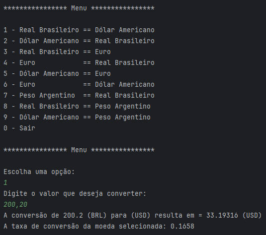

# Challenge - Conversor de Moedas - Oracle One 🚀
Desenvolvido em Java com a utilização da API ExchangeRate-API, este projeto permitira obter as taxas de cãmbio em tempo real.
## Descrição 💎
Sendo um projeto simples e eficiente, que buscara valores atualizados para que não se torne obsoleto, o usuário precisa apenas escolher as opções de cãmbio disponíveis e em seguida escolher o valor desejado. Para assim converter, por exemplo: valores em BRL para USD.
## Exemplo de saída: 💎

## Como utilizar? 🚀
* Você precisará baixar ou clonar o projeto em uma IDE de sua escolha.
* Também precisará obter uma chave API na ExchangeRate-API, você deverá inserir sua chave no atributo "key", no arquivo java "Requisicao" em src/com.github.leandromalikoski.conversormoeda/metodos conforme a imagem:

## Ferramentas e linguagens utilizadas
* Java
* Intellij IDEA
* ExchangeRate-API
* Github